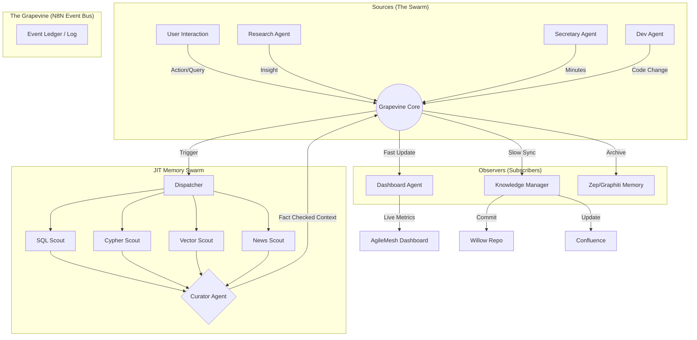

# 🍇 The Grapevine: Resilient Intelligent System Architecture

> "Think Blockchain. Think Resilient Intelligent System design."

## Concept

A central, asynchronous Event Bus ("The Grapevine") where all agents publish their actions, thoughts, and discoveries. Specialized "Observer Agents" subscribe to this stream to maintain system state, update documentation, and trigger JIT context.

## Architectural Diagram

## Implementation Strategy (N8N)

1.  **The Bus**: A master N8N workflow listening on a generic webhook (`/grapevine`).
2.  **The Ledger**: Log every event to Postgres instantly (Audit Trail).
3.  **The Routing**: Use N8N "Switch" nodes to route events based on `type` (e.g., `MEMORY_UPDATE`, `TASK_COMPLETE`, `NEW_IDEA`).
4.  **The Observers**:
    - **DashboardUpdater**: Filters for metric events -> Pushes to Board.
    - **Librarian**: Filters for "Knowledge" -> Batches updates for Repo/Wiki.

## Next Steps

1.  Prototype the `Grapevine` webhook in N8N.
2.  Connect the existing `Dashboard` to listen to this bus.
3.  Build the `Curator` logic (Idea-027).
